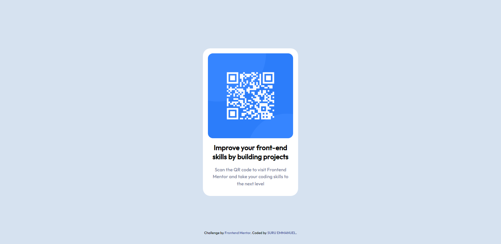

# Frontend Mentor - QR code component solution

This is a solution to the [QR code component challenge on Frontend Mentor](https://www.frontendmentor.io/challenges/qr-code-component-iux_sIO_H).

## Table of contents

- [Overview](#overview)
  - [Screenshot](#screenshot)
  - [Links](#links)
- [My process](#my-process)
  - [Built with](#built-with)
  - [What I learned](#what-i-learned)
  - [Continued development](#continued-development)
- [Author](#author)
- [Acknowledgments](#acknowledgments)

## Overview

### Screenshot

### Links

- Solution URL:(https://github.com/suruaino/Challenge0.git)
- Live Site URL:(https://suru-qrcode.netlify.app/)

## My process

### Built with

- Semantic HTML5 markup
- CSS custom properties
- Flexbox

### What I learned

Mastering the use of flex-box.

### Continued development

Will want to improve more on css properties.

## Author

- SURU EMMANUEL
- Frontend Mentor - [@suruaino](https://www.frontendmentor.io/profile/suruaino)
- Twitter - [@suruaino](https://www.twitter.com/suruaino)

## Acknowledgments

I want to use this opportunity to thank all my friends and well wishers.
